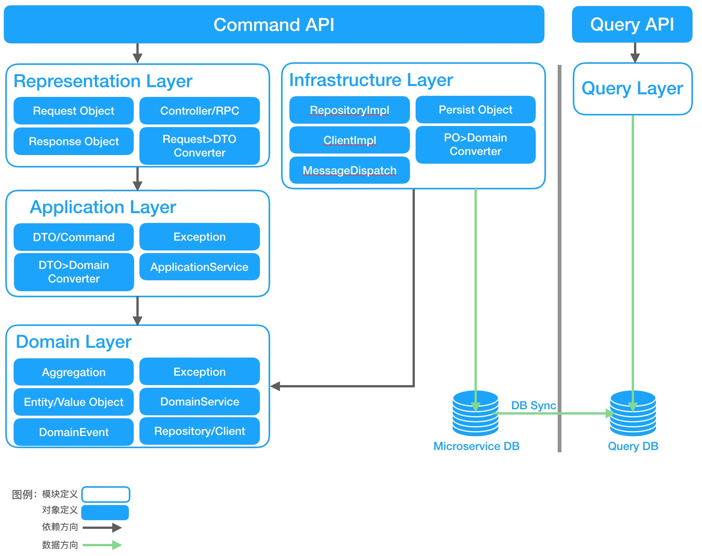

# ddd-code-samples

## Project Structure

## Business Background

业务基于库存管理的业务进行了脱敏和场景截取。 具体业务流程和细节可以参考下面的流程图等。

关键字： **库存系统**，商品，入库批次，**仓库**，仓库库存，库存出入库指令，库存调拨。

库存系统：
   
    即京西商城的仓库库存管理的系统。

仓库：

    京西商城的实体仓库，在该系统中主要关注的是仓库的配送区域及所持有商品得库存。

仓库库存：

    仓库中商品的库存。
    分别有：
        1. 采购在途数 ： 商品采购完成后入库途中的商品数量，在商品入库（变为实物库存）后需要按照实际入库数量进行变化。
        2. 实物库存： 仓库中商品的实际库存数量。
    
入库：
    
    入库指的是商品采购完成后运输到仓库后，经过盘点和确认后登记到仓库库存的行为。
    
入库批次：
    
    某个商品在入库时的批次，一个入库批次表示某个商品在同一时间内有N个该商品完成入库操作。
    包含： 仓库（仓库编码），商品（商品名称，商品编码，品类编码，供应商编码），入库时间，入库数。

库存出入库指令：

库存调拨：

1. 系统库存管理是通过库存出入库指令来实现的，库存出入库指令总共有两大类，分别是：入库指令，出库指令。 
   
   其中
    * 入库指令包含：采购入库和盘盈入库。 
    * 出库指令包含：盘亏出库和。
   同时系统还存在另外一种场景：库存调拨。
   库存调拨： 即从一个仓库调拨商品到另一个仓库以提升仓库的利用率及配送效率。
2. 
3. 

## Architecture Discussion Background
###第一次沟通

1.战术层面架构讨论基础基于Onion Architecture，定义四层代码结构：Representation层、Application层、Domain层、Infrastructure层。各层使用独立Jar包或Module强隔离，各层依赖顺序按图所示从外向内。
  
  
2.Representation层对象包括：
* 包括通过各种协议对外暴露的接口，该层内包含Request/Response对象定义（强制定义此对象，避免直接对外暴露领域对象）。但暂不对Request/Response外的其它DTO对象定义形式有要求，推荐可使用inner class或定义DTO class。
* 基于异常数据尽早拒绝服务的原则，该层包含数据格式校验逻辑，
* 该层包含convert对象定义，负责将Request/Response对象转换为Application层定义的DTO对象，装入Application层定义的Command中，以Application层定义的ApplicationService为入口操作。

3.Test层定义：
* Test中可包含测试金子塔的4类测试，即单元测试、持久层测试、接口层测试、契约测试。
* 如下建议可参考：单元测试是基础；持久层测试运行耗时久且易于发现可省略；接口层测试运行耗时久可考虑在端到端自动化测试中。

4.Application层对象包括：
* 用于入参/出参的DTO类型定义；
* 用于携带DTO数据的Command类型定义；
* 用于异常返回的Exception类型定义；
* ApplicationService类型定义，用于接收并处理Command；在ApplicationService中可使用Domain层定义的的Entity、DomainService、Repository上的方法；Transaction处理；发送DomainEvent；

5.Domain层对象包括：
* Aggregation、Entity、ValueObject类型定义；
* 用于依赖反转的Repository、Client接口类型定义；
* DomainEvent和其携带的DTO数据类型定义在共享包中，在Domain层完成DomainEvent产生；

6.Infrastructure层对象包括：
* 对Domain层定义的Repository的实现类RepositoryImpl，其内部包括JpaRepository；
* 对Domain层定义的Client的实现类ClientImpl，负责加载外部接口数据；
* 消息发送实现类；
* Convert类，用于将DB，第三方数据契约等数据对象转换为Domain层对象；

###第二次沟通
1.对上次讨论的DDD交付代码标准化进行了Review和补充，同时把各层对象的命名规则达成一致。
* Representation层只包括Request/Response对象定义，统一使用Request/Response后缀。其可携带Application层定义的DTO对象。
* Application层包括DTO对象定义，统一使用Request/Response后缀，入口方法使用DTO对象作为入参和出参。
* Domain层Aggregation、Entity、ValueObject等对象不使用后缀；
   * Domain层可定义Domain Exception；
   * Domain Event定义在Domain层（而非之前说的共享包）；Domain Event由Application层显示的发出（Optional）
* Infrastructure层中定义的数据库实体对象统一使用PO（Persist Object）后缀

2.对DDD中引入CQRS，利用Query层解决复杂查询。
* Query层完全独立，不依赖Application、Domain和Infrastructure任何一层。
* Query层引入后后端架构暂不考虑BFF，即BFF归入前端架构选型中。
* Query层独立设计和使用DB Schema，解决复杂查询，跨微服务查询，分页查询时的问题；同时引入了查询数据实效性问题。
   各微服务的数据通过Sync方式到Query DB中。类似于数据报表或宽表设计。Sync技术暂不在考虑。

3.Restful设计风格讨论
* HATEOAS风格，作为Rest成熟度最顶层，暂不引入到标准化中。
* 查询类API的参数传递，推荐使用Get请求，参数在URL中，复杂参数也如此；不使用Get请求参数为json格式或使用Post。
* Restful接口资源Url格式，因为很难定义标准格式，暂不将此项包含在标准化中。
